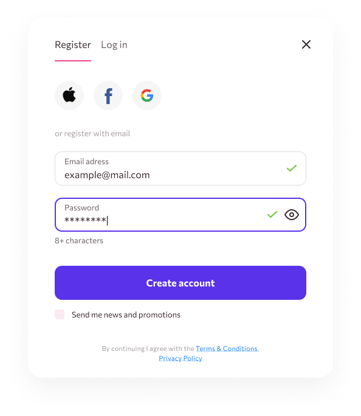
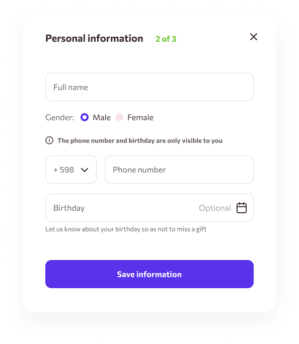
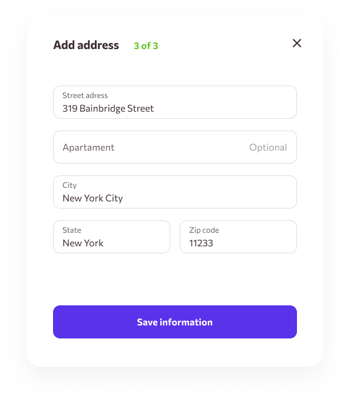
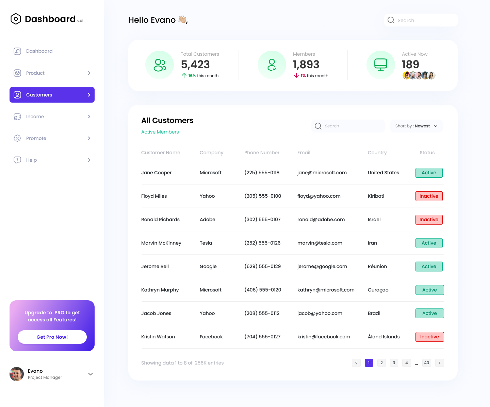

# React Task 03

## BUILDING A USER DASHBOARD INCLUDING USER AUTHENTICATION

This is the third task for the React course.

**Objective**: Replicate the design in this Figma link: https://www.figma.com/design/vUUpIZaDvoAtMDpUcMy3OI/-4.0-React-Task?node-id=0-1&t=MdeYAqdUGoDrFqcR-1

### Deployment Link

https://task03-gules.vercel.app/

## Instructions:

```
- Build out all the screens in the design.

- Use Firebase API's to integrate your sign up process and your login process.

- On successful signup, the application should display the login screen.

- On successful login, the application should route us to the dashboard screen.

- Validate all forms properly to the specifications provided by the design.

- Use React Router for navigating the application.

- Make sure your application replicates the design provided.

- Make your application responsive.
```

## **IMAGES**

**Register**


**Personal Information**


**Add Address**


**Login**


**DashBoard**

