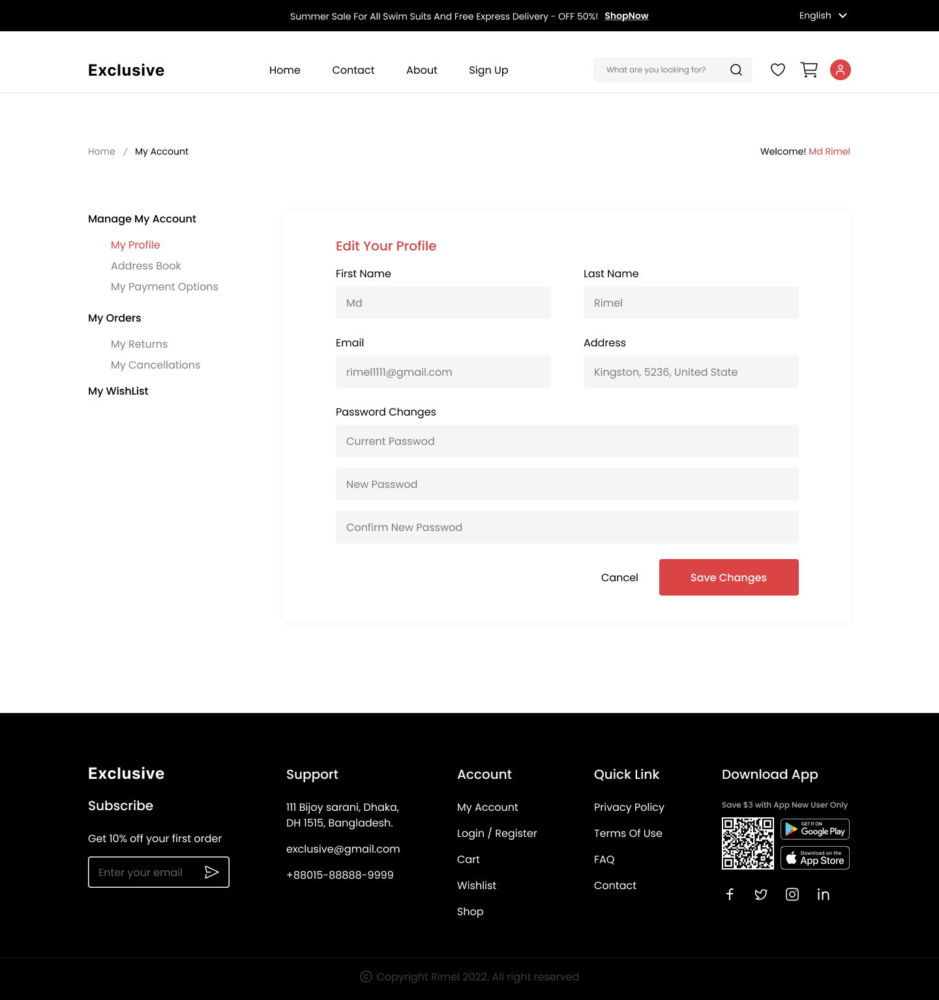

# React Task 04

This is the fourth task for the React course.

`LivePage`

**Objective:**
Replicate the design in this [Figma link](https://www.figma.com/design/ydkmBK3NiLlIJnK9TGIXhE/Full-E-Commerce-Website-UI-UX-Design-(Community)?node-id=193-4066&t=Kuv9sXV0bFIlOa05-0)

## Instructions

```markdown
 Screens to be built:

  1. E-Commerce HomePage
  2. Sign Up
  3. Log In
  4. Account Dropdown With account
  5. Wishlist
  6. Product Details page
  7. Cart
  8. 404 Error

•  Use Firebase API's to integrate your sign up process and your login process.
•  On successful signup, the application should display the login screen.
•  Validate all forms properly to the specifications provided by the design.
•  On successful login, user should be able to add product to cart and also view the content of their cart.
•  Use React Router for navigating the application.
•  Use Redux tool kit to manage state globally.
•  Make sure your application replicates the design provided.
•  Make your application responsive.

```

### Images

**E-Commerce HomePage**


**Sign Up**


**Log In**


**Account Dropdown With account**


**Wishlist**


**Product Details page**


**Cart**


**404 Error**

